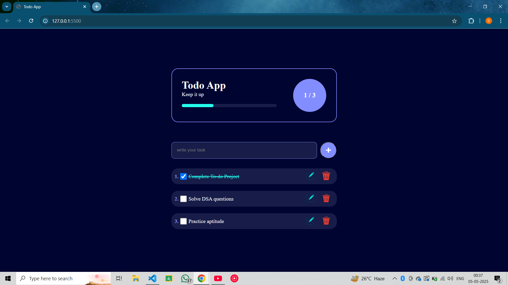

# 📝 Todo App

A minimal and stylish todo list web app to manage your daily tasks. Built using **HTML**, **CSS**, and **JavaScript** with local storage for saving data.

---

## 🚀 Features

- Add, edit, and delete tasks
- LocalStorage for persistence
- Progress bar with stats
- Confetti on full completion

---

## 🖼️ UI Preview

<!-- Screenshot will appear here -->


---

## 📁 Folder Structure

```
todo-app/
├── index.html
├── styles.css
├── app.js
├── README.md
├── Screenshot.png
└── img/
    ├── edit.png
    └── bin.png
```

---

## 🛠 How to Run Locally

```bash
git clone https://github.com/djs-18/todo-app.git
cd todo-app
open index.html  # or just double-click to open in browser
```

---

## 🌐 Live Demo

🔗 [View on GitHub Pages](https://djs-18.github.io/TODO-APP/)

---

## 👤 Author

**Dibyajyoti Satpathy** — [GitHub](https://github.com/djs-18)
